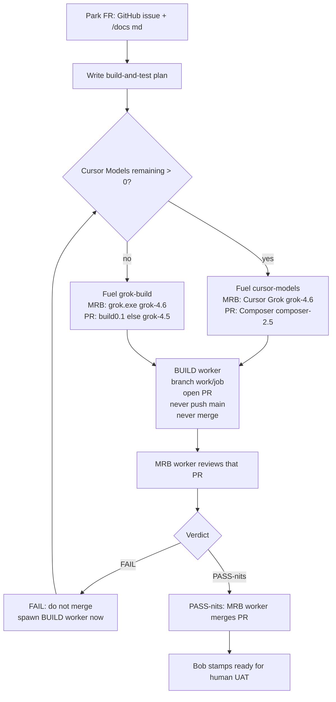

# Bob functional-spec build loop

Bob orchestrates. He does not implement and does not write the MRB. A worker
agent (Cursor Models, else grok.exe) does both. Copilot only with
`-AllowCopilot`.

Fuel is not a judgment. If Cursor Models remaining > 0, use Cursor Models
(Cursor Grok + Composer). If remaining is 0, use grok.exe. Never Other Models.

Canonical mermaid for README and this skill. Verdict bars: `bob-hostile-mrb`.
Handoff scripts: `cursor-mrb-dev`. Remaining numbers: `box-usage`.
Driver (start job, MRB, retry failed cursor/grok jobs, notify on
PASS-nits): `tools/Start-BobBuildLoop.ps1` / skill `bob-job-loop`.

## Transaction (do not skip, do not reason)

| Event | Next action | Who |
|---|---|---|
| FR + plan parked | `Start-BobBuild -Task git` | dispatcher |
| Worker finished on `work/<job>` | Open a PR against `main`. Never push `main`. Never merge. | that worker |
| PR opened | Immediately `Start-BobMrbHandoff` on the PR head SHA. **New worker**, new job, `-Kind mrb`. Never the implementer. Never resume the PR worker. | dispatcher |
| MRB **FAIL** | Do not merge. Immediately `Start-BobBuild -Task git -Fix` with Required fixes. Worker opens a **new** PR. | dispatcher |
| MRB **PASS-nits** | MRB worker merges the PR (`gh pr merge`). Nits do not block. | that MRB worker |
| candidate PASS-UAT | Stamp or reject the phrase **ready for human UAT** | Bob only |

Fuel is re-read at every dispatch (`Select-BobGitWorker`). Cursor Models remaining
> 0 -> `cursor-models`. Else `grok-build`.

## When which skill

| Situation | Skill |
|---|---|
| Fresh functional spec / new product | `bob-spec-intake` then `bob-build-dispatch` |
| Feature-request on an existing repo | `bob-spec-intake` then `bob-build-dispatch` |
| Parked FR; run until PASS-nits | `bob-job-loop` (`Start-BobBuildLoop.ps1`) |
| PR opened; need review | `bob-hostile-mrb` / `cursor-mrb-dev` |
| Fuel / login / Kind for a single handoff | `cursor-mrb-dev` |
| Start/monitor/stop the Windows job | `grok-build-fleet` |
| Named Grok Bot silent | `unstick-grok-bot` |
| Cursor Models remaining / Sand / overage | `box-usage` |

## Hard rules

- New product repos: **public** under `SimonBarnett` unless Simon says otherwise.
- Feature work: **do not break** prior versions; use `v2/` / `v3/` (or next free version folder).
- Worker output is a **PR**. The dispatcher hands that PR to a **different**
  worker for MRB (new job, `-Kind mrb`). The implementer never reviews or
  merges their own PR. MRB output is FAIL (spawn FIX worker) or PASS-nits
  (that MRB worker merges).
- Never Other Models (`claude-opus-5-thinking-high` and friends) for this loop.
- Never put `password=` or `XAI_API_KEY=` **assignments** in goals (`Test-PromptSecrets`).
- MRB is a GitHub issue, not a PDF.
