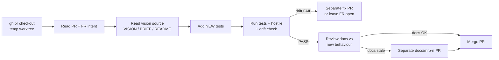

---
name: bob-mrb-worker
description: >
  STANDARD Material Review Board worker process for every seat that does MRB.
  Tests-first hostile review against the FR and the repo vision (drift check);
  after PASS, review docs for stale behavior; if needed open exactly one
  separate docs/mrb-<n> PR and merge it with the original. FAIL opens exactly
  one fix PR then merges original + fix. Use when the user says MRB, hostile
  review, review the push, Start-BobMrb, bob-mrb-worker, standard MRB process,
  or /bob-mrb-worker. Handoff launch: bob-hostile-mrb / cursor-mrb-dev. Loop:
  bob-job-loop. Bob alone stamps UAT.
github: https://github.com/SimonBarnett/agentic_build
---

# MRB worker (STANDARD)

Foundation: `harvest-agent-skills` (honesty box / Three Laws) -> report back to
https://github.com/SimonBarnett/agentic_build.

This is the **CAST IRON** process for **all** workers doing MRB — Cursor,
grok.exe, Copilot, free agents, talk seats, shop workers. Different worker
than the PR author. Do not invent a parallel ritual.

Handoff / board posting: `bob-hostile-mrb` + `tools/Start-BobMrbHandoff.ps1`.
Fuel / launch: `cursor-mrb-dev` / `start-bob-cursor`. Dispatcher: `bob-job-loop`.

## Standing process (verbatim)

1. Use `gh pr checkout` in a temporary worktree; read the PR intent + changed files
2. **Find the vision (FR #351).** Read, in order: `VISION.md` / visionary brief
   (`*_BRIEF.md`, skills-visionary output), README purpose/goals, CAST IRON rules
   (including Three Laws via `harvest-agent-skills`), and the source FR intent.
   Quote 1–2 vision lines in the MRB board that the PR is judged against.
3. BEFORE testing: add any NEW tests appropriate to the PR
4. Run existing + new tests; perform the hostile review **and** the **drift check**
   (separate verdict line — see below). Drift is a FAIL like a test failure.

5. Encoding (FR #347): on changed `*.md` run `python tools/check_utf8_mojibake.py --root . <paths>`; UTF-8 without BOM.
6. PASS → review README, skills, `docs/`, mermaid diagrams, and usage/help text
   for anything the PR made stale. If docs are stale, open exactly ONE **separate**
   docs PR from `docs/mrb-<n>-...` against `main` (never push onto the PR under
   review — FR #348). Merge original + docs PR; if docs OK, merge original only.
   Then close the source issue/FR and hand off to a separate UAT worker; only Bob
   stamps UAT.
7. FAIL → create exactly ONE **separate** fix PR with the fix, then merge both
   (original + fix). Not multiple fix PRs.
8. Jeeves announces whatever happens (merge / fix+merge)

_Caption: vision first; drift is a first-class FAIL; docs stay on a separate PR._

## Vision / drift check (FR #351)

**Drift verdict** (required line on the MRB board):

- Serves the stated vision and success metric?
- Contradicts CAST IRON / Three Laws / earlier decisions?
- Scope creep (features/deps/behaviour not asked)?
- Under-delivery (closes FR letter but misses intent — e.g. code never wired)?

**If the PR shows the vision itself should change:** do **not** edit the vision.
File one FR tagged `vision` for Simon; leave the product PR waiting.

**No vision source found:** record `no vision source found`, review against README
+ FR only, and file **one** FR asking for `VISION.md` (dedupe: one open request
per repo).

### Worked example (tests PASS, drift FAIL)

PR adds an LLM client to `gh-Jeeves` "token-free" digest path. Unit tests green;
FR text said "improve routing". Vision (gh-Jeeves brief): GitHub event → worker
without model tokens. **Drift FAIL** — contradicts token-free success metric.
Fix PR removes the LLM dependency (or FR left open). MRB quotes: "token-free
path from GitHub event to worker".

## FR mode vs MRB mode (FR #343 CAST IRON)

| Mode | Who | Allowed | Forbidden |
|------|-----|---------|-----------|
| **FR / implementer** | Dev seat | Open one PR, post URL, stop | `gh pr merge`, self-approve+merge, close FR after self-merge |
| **MRB** | **Different** seat (or **fresh session** if only one seat) | Tests-first + vision/drift; PASS merge; FAIL one fix then merge both | Author MRB/merge of their own implementer PR in the same session |

Pack text: `docs/fr-mode-no-self-merge.md`, `docs/worker-pack-fr-mode.md`.  
Guards: `tools/fr_self_merge_guard.py`, `tools/mrb_docs_branch_guard.py` (when present).

## Hard rules

- **Different worker than author.** Never MRB your own implementer PR.
- **FR authors never merge.** Opening the PR is the end of FR mode.
- **Vision before verdict (FR #351).** Quote vision lines; drift FAIL blocks merge.
- **UTF-8 no BOM (FR #347).** Check changed `*.md` with `tools/check_utf8_mojibake.py` before PASS.
- **Three Laws / honesty box.** Bound by `harvest-agent-skills`; do not gut CAST IRON.
- **Tests before verdict.** New tests land before PASS or FAIL.
- **PASS → docs review, then merge (FR #348).** Separate `docs/mrb-<n>` PR if stale;
  never push onto the reviewed branch.
- **FAIL → one fix PR only.** Merge original + that one fix.
- **No UAT stamp by worker.** Only Bob stamps UAT.
- **Shop channel only** for worker IRC about this MRB.
- **Webhook report:** include **agent + model**.
- No MRB PDFs. No secrets. Never Other Models. Copilot only with `-AllowCopilot`.

## After merge

Same duty as `bob-hostile-mrb`: close finished boards, pull completed
PRs onto product main, recycle-after-merge when merging `agentic_build`
or `agentic_irc` (Bob/ionos recycle; implementer PR workers do not
live-recycle).

## Free-agent harvest (CAST IRON)

When **setting up a free agent** (any seat that will do MRB), harvest
this process into that agent's instruction/context — link this skill
(`bob-mrb-worker`) so the next seat follows the same standard. Do not
leave MRB process only in chat memory.

## Related

| Concern | Skill |
|---|---|
| Hand off / GitHub MRB issue / PASS-nits board labels | `bob-hostile-mrb` |
| Fuel + FIX/MRB launch until done | `cursor-mrb-dev` |
| Driver `Start-BobBuildLoop.ps1` | `bob-job-loop` |
| Pointer map | `bob-build-loop` |
| Honesty box / Three Laws harvest | `harvest-agent-skills` |
| Separate docs PR | FR #348 |
| Vision source | `VISION.md`, skills-visionary, `*_BRIEF.md` |
