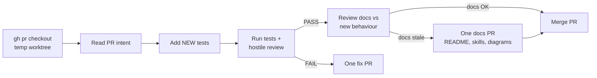

# MRB worker (STANDARD)

Foundation: `harvest-agent-skills` (honesty box) -> report back to
https://github.com/SimonBarnett/agentic_build.

This is the **CAST IRON** process for **all** workers doing MRB — Cursor,
grok.exe, Copilot, free agents, talk seats, shop workers. Different worker
than the PR author. Do not invent a parallel ritual.

Handoff / board posting: `bob-hostile-mrb` + `tools/Start-BobMrbHandoff.ps1`.
Fuel / launch: `cursor-mrb-dev` / `start-bob-cursor`. Dispatcher: `bob-job-loop`.

## Standing process (verbatim)

1. Use `gh pr checkout` in a temporary worktree; read the PR intent + changed files
2. BEFORE testing: add any NEW tests appropriate to the PR
3. Run existing + new tests; perform the hostile review
4. Encoding (FR #347): on changed `*.md` (and other text you touch), run
   `python tools/check_utf8_mojibake.py --root . <paths>` — fail on UTF-8 BOM
   or mojibake (`(mojibake)`, `(mojibake)`, `(mojibake)`, `(mojibake)`). Writers must use UTF-8 **without** BOM
   (`tools/Utf8NoBom.ps1` / `UTF8Encoding $false`). See `docs/utf8-no-bom.md`.
5. PASS → review README, skills, `docs/`, mermaid diagrams, and usage/help text
   for anything the PR made stale. If docs are stale, open exactly ONE docs PR
   against `main` with the corrections and merge it together with the original;
   if docs are OK, merge the original PR as before. Then close the source
   issue/FR and hand off to a separate UAT worker; only Bob stamps UAT.
6. FAIL → create exactly ONE fix PR with the fix, then merge both
   (original + fix). Not multiple fix PRs.
7. Jeeves announces whatever happens (merge / fix+merge)

## FR mode vs MRB mode (FR #343 CAST IRON)

| Mode | Who | Allowed | Forbidden |
|------|-----|---------|-----------|
| **FR / implementer** | Dev seat | Open one PR, post URL, stop | `gh pr merge`, self-approve+merge, close FR after self-merge |
| **MRB** | **Different** seat (or **fresh session** if only one seat) | Tests-first review; PASS merge; FAIL one fix then merge both | Author MRB/merge of their own implementer PR in the same session |

Pack text: `docs/fr-mode-no-self-merge.md`, `docs/worker-pack-fr-mode.md`.  
Guard: `tools/fr_self_merge_guard.py` / `tools/Assert-FrPrNoSelfMerge.ps1` (flag self-merge within N minutes).

## Hard rules

- **Different worker than author.** Never MRB your own implementer PR.
- **FR authors never merge.** Opening the PR is the end of FR mode.
- **Tests before verdict.** New tests land on the review branch (or the
  single fix branch) before you claim PASS or FAIL. Run existing + new.
- **UTF-8 no BOM (FR #347).** Never round-trip markdown through PS5
  `Get-Content | Set-Content` without encodings. Check changed `*.md` with
  `tools/check_utf8_mojibake.py` before PASS.
- **PASS → docs review, then merge.** After tests and hostile review PASS,
  review README, skills, `docs/`, mermaid diagrams, and usage/help text for
  stale behavior. If anything is stale, open exactly **one** docs PR against
  `main` and merge it together with the original PR; if docs are fine, merge
  the original as before (`gh pr merge --merge`). Then close the source FR /
  issue, pull main, and hand off to a separate UAT worker. Only Bob stamps
  UAT. See `bob-hostile-mrb` close/merge/pull + recycle-after-merge.
- **FAIL → one fix PR only.** Do not spawn a chain of FIX workers / many
  fix PRs. Open **exactly one** fix branch/PR with the fix (include the
  new tests). Then merge **both** the original PR and that one fix PR.
  Jeeves announces both.
- **No UAT stamp by worker.** Only Bob declares ready for human UAT. If
  you believe it is UAT-ready, write `candidate PASS-UAT, Bob stamp
  required` — never stamp UAT yourself.
- **Shop channel only** for worker IRC chatter about this MRB (machine
  shop `#<machine>`, not spam on `#bobiverse`).
- **Webhook report:** when posting report / completion webhook, include
  **agent + model** (e.g. cursor-agent `grok-4.6`, grok.exe `grok-4.6`).
- No MRB PDFs. No `password=` / `XAI_API_KEY=` assignments. Never Other
  Models. Copilot only with `-AllowCopilot`.

## After merge

Same duty as `bob-hostile-mrb`: close finished boards, pull completed
PRs onto product main, recycle-after-merge when merging `agentic_build`
or `agentic_irc` (Bob/ionos recycle; implementer PR workers do not
live-recycle).

## Free-agent harvest (CAST IRON)

When **setting up a free agent** (any seat that will do MRB), harvest
this process into that agent's instruction/context — link this skill
(`bob-mrb-worker`) so the next seat follows the same standard. Do not
leave MRB process only in chat memory.

## Related

| Concern | Skill |
|---|---|
| Hand off / GitHub MRB issue / PASS-nits board labels | `bob-hostile-mrb` |
| Fuel + FIX/MRB launch until done | `cursor-mrb-dev` |
| Driver `Start-BobBuildLoop.ps1` | `bob-job-loop` |
| Pointer map | `bob-build-loop` |
| Honesty box harvest | `harvest-agent-skills` |
