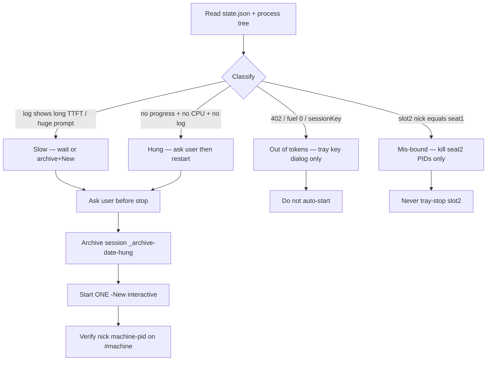

# Restart worker seat (diagnose first)

Foundation: harvest-agent-skills (honesty box) -> report back to
https://github.com/SimonBarnett/agentic_build.

Harvested from Bob-1 (2026-09-25): flamingo seat stopped as "hung" while it
was still working on a huge resumed session (first token ~445s, CPU idle).
Related automated fixes: AgentMonitor #97 (slot binding), agentic_build
#99/#101 (hang detection), #345 (second seat IrcHome), #346 (Restart
watcher reinstall), #352 (busy seats / restart policy).

## CAST IRON

1. **Diagnose read-only first.** Map the seat from `state.json` + process
   tree for **this** home. Never from remembered PIDs.
2. **Ask the user** before stopping or restarting a seat.
3. **Never touch** the ear (`bob-*`), the tray, the job watcher, Ergo, or
   Jeeves unless Simon named that target.
4. **Mis-bound seat 2:** if tray log says `irc seat already up nick=<seat1>`,
   slot 2 is on seat 1's home (AgentMonitor #97 / #345). Do **not** stop seat 2
   via tray teardown (it disconnects seat 1). Force-stop only seat 2's own PIDs.
5. **Out of tokens:** do not auto-start. Use the tray out-of-tokens path so
   the session key dialog appears. If the user will start it, do nothing.
6. **Fresh-session restart:** archive the session (never delete); start ONE
   `-New` seat; verify nick `{machine}-{pid}` on `#{machine}` only; at most
   two start attempts; re-send ACKed-but-not-DONE jobs as retry (prior ACK void).

_Caption: diagnose (slow / hung / no tokens / mis-bound), then ask before restart; archive never delete; one `-New` start._

## Diagnose checklist

| Signal | Meaning | Action |
|--------|---------|--------|
| Huge `updates.jsonl` / prompt tokens; long time-to-first-token; low CPU | **Slow**, not hung | Prefer wait; or archive + fresh `-New` with user OK |
| No log progress, no CPU, no ACK after long idle | Likely **hung** | Ask user; then fresh-session restart |
| Tray `fuel remaining 0`, `sessionKey=yes`, 402 / usage exhausted | **Out of tokens** | Tray key-dialog path only; never silent start |
| `irc seat already up nick=<other>` on slot 2 start | **Mis-bound** home | Kill only slot-2 PIDs; fix via #97/#345 deploy |

## Fresh-session restart (after user OK)

1. Record the launch command / slot / IrcHome from state.
2. Stop the seat tree by **those PIDs only** (not tray Stop that tears down IRC for another slot).
3. Archive the session dir to `_archive-<yyyyMMdd>-hung` (never delete).
4. Start **one** `-New` watch/talk seat via tray path or a one-shot interactive
   scheduled task (delete the task after it fires). Prefer interactive session
   so the TUI is visible.
5. Verify: nick = `{machine}-{rootPid}`, JOINed `#{machine}` only, slot 1 unless
   intentional slot 2 with its own home, first turn completed.
6. At most **two** start attempts.
7. Re-queue ACKed-but-not-DONE work: tell the seat "retry, prior ACK void".

## Do not

- Close mis-bound seat 2 from the tray Agents stop (disconnects seat 1).
- Auto-start when the box has no tokens / no key.
- Touch ear, tray process (except asking user to use Restart watcher #346),
  Watch-BobJobs, Ergo, or Jeeves.
- Invent PIDs or kill another home's IRC children.

## Related

| Concern | Skill / issue |
|---------|----------------|
| Talk-seat kill/roll | `killproc` |
| Named Grok Bot Temporal | `unstick-grok-bot` |
| Tray Restart watcher full reinstall | `bob-fleet-tray` / #346 |
| Second seat explicit IrcHome | #345 / AgentMonitor #97 |
| Hang / wake queue | #99 / #101 |
| Busy seats during reinstall | #352 |
