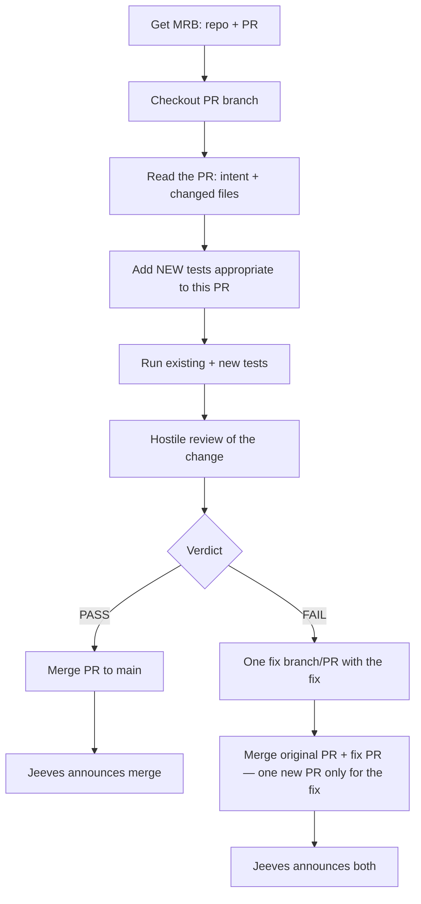

# agentic_build

Any Grok Bot starts git tasks on named machines. Skill: `.grok/skills/grok-build-fleet`. Grok Bot desktop runs on every build box; `grok.exe` is the Windows logon user (MSSQL integrated auth).

- Git task: `Start-BobBuild -Task git` (optional `-Machine` / `-Fuel`). `Select-BobGitWorker` picks a `(machine, fuel)` pair. Fuels: `cursor-models` (shared Cursor Models top-bar pool), `grok-build`, `copilot`, `grok-bot`, `on-demand`.
- Pull worker `tools/Watch-BobJobs.ps1` (logon task, not a Windows service). Tray: `tools/Watch-BobTray.ps1`.
- Named bots (`-Agent Bob`) still use the Grok Bot API. Form Prep stays `--rules`, never `--always-approve`, pin `-Fuel grok-build`.
- Off-DEV Fake-Grok never touches live bots or GitHub. DUMB / 2012 is not a git-task worker.

## Bob functional-spec build loop

Skills (copied by Install-BobFleet into `~\.grok\skills`):

| Skill | Only job |
|---|---|
| bob-spec-intake | Park FR issue + `/docs` md |
| bob-build-dispatch | Write plan + `Start-BobBuild -Task git` |
| bob-job-loop | `Start-BobBuildLoop.ps1` retry + PASS notify |
| bob-mrb-worker | STANDARD MRB process: tests-first; PASS merge; FAIL one fix PR |
| bob-hostile-mrb / cursor-mrb-dev | Hand off MRB boards; worker steps -> bob-mrb-worker |
| grok-build-fleet | Start/monitor/stop; picker; heal `Watch-BobJobs` |
| bob-build-loop | Pointer to the five rows above (no separate ritual) |
| start-bob-copilot | Hand GitHub repo work to Copilot (`Start-BobCopilot.ps1`) |
| start-bob-cursor | Hand git task to Cursor Agent (`Start-BobCursor.ps1`) |
| unstick-grok-bot | Unstick a named Grok Bot Temporal hang |
| bob-irc | Fleet `#bobiverse` on Ergo `irc.ntsa.uk:6697` |
| setup-github-webhooks | How to add GitHub repo hooks (`/bob/v1/git`) |
| setup-ssl-certs | How to issue IIS Let's Encrypt with win-acme |

When another agent cannot complete a task, they write a **functional specification** and send it to **Bob**. Feature work arrives as a **GitHub issue** plus `/docs` markdown. Bob orchestrates; he does **not** implement and does **not** write the hostile MRB in-session. Both the PR and the MRB are handed to a worker agent.

**Fuel (no judgment):** if Cursor Models remaining > 0, use Cursor Models (Cursor Grok + Composer). If remaining is 0, use grok.exe. Never Other Models. Copilot only with `-AllowCopilot`. Tray top bar must show that Cursor Models remaining %.

**PR workers:** Cursor **`composer-2.5`**, or grok.exe **`build0.1`** when listed else **`grok-4.5`**. **MRB:** Cursor Grok **`grok-4.6`** on cursor-agent, else grok.exe **`grok-4.6`**. Every worker opens a **PR**. STANDARD MRB: `bob-mrb-worker` — PASS: the MRB agent **merges**; FAIL: exactly **one** fix PR then merge original + fix. Only Bob stamps UAT.

### Fleet machines (registry ids)

Canonical list: `config/fleet-registry.json`. Clone paths on this legion:

| id | Role | Clone path |
|---|---|---|
| `ionos` | VPS; Ergo host; pull worker | `C:\\ai\\agentic_build` |
| `marchhare` | Dual-homed build box | `D:\\ai\\agentic_build` |
| `flamingo` | Club Madeira seat | `C:\\src\\agentic_build` |
| `ce-priority-dev1` | Form Prep / Priority Azure | `C:\\src\\agentic_build` |

IRC status uses nick `bob-dev1` for `ce-priority-dev1`. Job audit lines: `docs/job-audit-line.md`. GitHub protection intent: `docs/github-main-protection-checklist.md`.

### New product (fresh functional spec)

1. Create a **new public** GitHub repository under `SimonBarnett`.
2. Commit the functional specification under `/docs`.
3. From the spec, write a **full detailed build and test plan** a build agent can execute; commit it under `/docs`.
4. `Start-BobBuildLoop.ps1` (skill `bob-job-loop`) starts the git worker, hands off MRB, retries failed cursor/grok jobs, and prints `DONE` on PASS-nits. Or `Start-BobBuild -Task git` (picker: Cursor Models remaining > 0, else grok-build) and hand each row yourself.
5. Worker implements on `work/<job>` and **opens a PR**. Never push `main`. Never merge.
6. Bob **hands off** hostile MRB on that PR (`Start-BobBuildLoop.ps1` or `tools/Start-BobMrbHandoff.ps1`). The worker posts a **new** GitHub issue `MRB FAIL|PASS-nits: <slug> <sha>` (labels `mrb` + `mrb-fail` or `mrb-pass`). Missing features get parked as new FRs. No MRB PDF.
7. MRB follows `bob-mrb-worker`: add NEW tests before testing; run existing + new; hostile review. **PASS:** merge the PR. **FAIL:** open exactly **one** fix PR with the fix, then merge original + fix (not multiple fix PRs). Jeeves announces. Only **Bob** stamps **ready for human UAT**.

### Feature request (extends existing repo)

1. Must **not break** previous versions.
2. Add new work in versioned folders such as `v2/`, `v3/` (keep prior folders intact).
3. Park `docs/feature-request-<slug>-YYYY-MM-DD.md` plus a GitHub issue (`bob-spec-intake`).
4. `Start-BobBuildLoop.ps1` (or `Start-BobBuild -Task git`) to implement and **open a PR**.
5. Same PR/MRB transaction as above (new issue per PR head; `bob-mrb-worker` PASS merge / FAIL one fix PR then merge both; Bob stamps UAT). Git is the source of truth.

### Flow



Full product loop (park / fuel / build) still uses `bob-spec-intake` +
`bob-build-dispatch` + `bob-job-loop`. The diagram above is the **STANDARD**
MRB worker process (`bob-mrb-worker`).

### Talking to build agents

Use **BobBridge** for job lifecycle (`Start-BobBuild -Task git`, `Send-BobBuildSpec`, `Get-BobBuild`, `Stop-BobBuild`).

Fleet status is **[agentic_irc](https://github.com/SimonBarnett/agentic_irc)** on private Ergo `irc.ntsa.uk:6697` (`#bobiverse`, skill `bob-irc`).

- `scripts/irc_agent.py` — TLS join, PASS from env / connect file, announce AGPK.
- `scripts/seal.py` — SEAL v2 for secrets (TOFU-pinned DH-AAD). Never send secrets in cleartext; never dump `inbox/*.bin` into chat.
- IRC verbs (no vendor names): `SPEC` `WAIT` `BUILD` `PUSH` `MRB` `FIX` `UAT`. Pass the MRB issue URL on `FIX`.
- Two agents on one box need different `--home` / `AGENTIC_IRC_HOME` directories.

### Guardrails

- Bob orchestrates and stamps UAT. Workers open PRs. The dispatcher hands each PR to a **different** worker for MRB (`Start-BobMrbHandoff`, new job, `-Kind mrb`). The implementer never reviews or merges their own PR. PASS: that MRB agent merges. FAIL: exactly one fix PR then merge both (`bob-mrb-worker`). No in-session MRB or implementation.
- Cursor Models remaining % is the tray top bar and the fuel gate, not a fleet machine id, not Grok Bot Sand, not Other Models.
- New product repos are **public** under `SimonBarnett` unless Simon says otherwise.
- Never mark ready for human UAT until Bob stamps that phrase on the issue.

## Off-DEV (no real grok)

```powershell
powershell -NoProfile -File .\\tools\\Test-Pack.ps1
```

Points `BOB_GROK_EXE` at `tools/Fake-Grok.ps1` and uses a temp `BOB_BRIDGE_HOME`. Must not touch `%USERPROFILE%\\.grok\\bob-bridge`.

## Use

```powershell
Import-Module .\\src\\BobBridge.psd1
Register-BobMachine -Id ionos -CwdRoots C:\\ai
Start-BobBuild -Task git -Cwd C:\\ai\\agentic_build -Goal 'ping' -Profile generic
Start-BobBuild -Machine ionos -Fuel grok-build -Cwd C:\\ai\\agentic_build -Goal 'ping' -Profile generic
powershell -NoProfile -File .\\tools\\Watch-BobJobs.ps1 -Once
Get-BobBuild -JobId <id>
```

Install the logon watcher + user skill copy (not a Windows service):

```powershell
powershell -NoProfile -File .\\tools\\Install-BobFleet.ps1 -MachineId marchhare
```

Form Prep on DEV1 still uses grok.exe:

```powershell
$env:BOB_GROK_EXE = "$env:USERPROFILE\\.grok\\bin\\grok.exe"
Start-BobWorker -Cwd D:\\work\\formprep -Prompt 'PONG' -Profile formprep
```

`BOB_TRANSPORT=cli` forces grok.exe. `BOB_GROK_BOT_HOME` overrides the Grok Bot profile dir.

## Layout

```
agent_readme.md  handover for any Grok Bot (attach this)
.grok/skills/    grok-build-fleet, start-bob-copilot, bob-mrb-worker, bob-hostile-mrb, bob-*
docs/            feature requests, plans, harvest log
schemas/         health overlay status completion prompt-packet
src/             BobBridge module (Public/Private)
config/          default.json, bobiverse.json, bob-seats.json
tools/           Watch-BobJobs, Watch-BobTray, Start-BobBuildLoop, run-bob-build-loop, Start-BobMrbHandoff, Test-Pack
tests/           last-dev-run.md template
```
