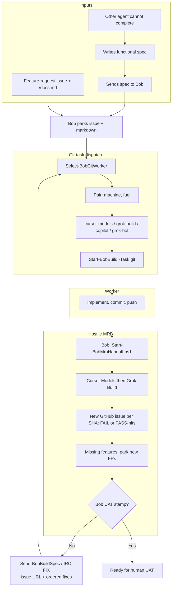

# agentic_build

Any Grok Bot starts git tasks on named machines. Skill: `.grok/skills/grok-build-fleet`. Grok Bot desktop runs on every build box; `grok.exe` is the Windows logon user (MSSQL integrated auth).

- Git task: `Start-BobBuild -Task git` (optional `-Machine` / `-Fuel`). `Select-BobGitWorker` picks a `(machine, fuel)` pair. Fuels: `cursor-models` (shared Cursor Models pool, not a machine named cursor), `grok-build`, `copilot`, `grok-bot`, `on-demand`.
- Pull worker `tools/Watch-BobJobs.ps1` (logon task, not a Windows service). Tray: `tools/Watch-BobTray.ps1`.
- Named bots (`-Agent Bob`) still use the Grok Bot API. Form Prep stays `--rules`, never `--always-approve`, pin `-Fuel grok-build`.
- Off-DEV Fake-Grok never touches live bots or GitHub. DUMB / 2012 is not a git-task worker.

## Bob functional-spec build loop

Skills (copied by Install-BobFleet into `~\.grok\skills`):

| Skill | Role |
|---|---|
| grok-build-fleet | Start/monitor/stop jobs; heal Watch-BobJobs; git-task picker |
| start-bob-copilot | Hand GitHub repo work to Copilot (`Start-BobCopilot.ps1`) |
| start-bob-cursor | Hand git task to Cursor Agent (`Start-BobCursor.ps1`) |
| cursor-mrb-dev | Cursor MRB then FIX until PASS-nits (`Start-BobMrbHandoff.ps1` / `Start-BobCursor.ps1`) |
| bob-build-loop | Orchestrator: park, dispatch, hand off MRB, UAT stamp |
| bob-spec-intake | Park FR as GitHub issue + `/docs` markdown |
| bob-build-dispatch | Write build-and-test plan + `Start-BobBuild -Task git` |
| bob-hostile-mrb | Bob **hands off** hostile MRB; missing features become new FRs; no PDF |
| unstick-grok-bot | Unstick a named Grok Bot Temporal hang |
| bob-irc | Fleet `#bobiverse` on Ergo `irc.ntsa.uk:6697` (not Libera) |

When another agent cannot complete a task, they write a **functional specification** and send it to **Bob**. Feature work arrives as a **GitHub issue** plus `/docs` markdown. Bob orchestrates; he does **not** implement and does **not** write the hostile MRB in-session. A git-task worker (Cursor Models, grok.exe, Grok Bot; Copilot only with `-AllowCopilot`) implements. Builders: **`build0.1`** when `grok models` lists it, else **`grok-4.5`**; Cursor **`composer-2.5`**. MRB uses the latest reasoning model (`grok-4.6` / `claude-opus-5-thinking-high`). Machines: `ionos`, `flamingo`, `marchhare`, `ce-priority-dev1`.

### New product (fresh functional spec)

1. Create a **new public** GitHub repository under `SimonBarnett`.
2. Commit the functional specification under `/docs`.
3. From the spec, write a **full detailed build and test plan** a build agent can execute; commit it under `/docs`.
4. `Start-BobBuild -Task git` (picker chooses machine+fuel unless you pin). Prefer `build0.1` on grok-build when listed, else `grok-4.5`.
5. Worker implements, **commits and pushes**.
6. On each pushed SHA: Bob **hands off** hostile MRB (`tools/Start-BobMrbHandoff.ps1`). The worker posts a **new** GitHub issue `MRB FAIL|PASS-nits: <slug> <sha>` (labels `mrb` + `mrb-fail` or `mrb-pass`). Missing features get parked as new FRs. No MRB PDF.
7. On **FAIL**, dispatch a **build** worker (`Start-BobCursor -Kind build` or grok-build), commit and push, then re-MRB the new SHA. Repeat until **PASS-nits**. Only **Bob** stamps **ready for human UAT**.

### Feature request (extends existing repo)

1. Must **not break** previous versions.
2. Add new work in versioned folders such as `v2/`, `v3/` (keep prior folders intact).
3. Park `docs/feature-request-<slug>-YYYY-MM-DD.md` plus a GitHub issue (`bob-spec-intake`).
4. `Start-BobBuild -Task git` to implement, commit, and push.
5. Same per-SHA MRB loop as above (new issue per SHA; FAIL → build worker → re-MRB until PASS-nits; Bob stamps UAT). Git is the source of truth.

### Flow



### Talking to build agents

Use **BobBridge** for job lifecycle (`Start-BobBuild -Task git`, `Send-BobBuildSpec`, `Get-BobBuild`, `Stop-BobBuild`).

Fleet status is **[agentic_irc](https://github.com/SimonBarnett/agentic_irc)** on private Ergo `irc.ntsa.uk:6697` (`#bobiverse`, skill `bob-irc`). Not Libera.

- `scripts/irc_agent.py` — TLS join, PASS from env / connect file, announce AGPK.
- `scripts/seal.py` — SEAL v2 for secrets (TOFU-pinned DH-AAD). Never send secrets in cleartext; never dump `inbox/*.bin` into chat.
- IRC verbs (no vendor names): `SPEC` `WAIT` `BUILD` `PUSH` `MRB` `FIX` `UAT`. Pass the MRB issue URL on `FIX`.
- Two agents on one box need different `--home` / `AGENTIC_IRC_HOME` directories.

### Guardrails

- Bob orchestrates and stamps UAT. Workers implement. Bob **hands off** hostile MRB (Copilot / git-task); he does not write it in Grok Bot.
- Cursor Models is a shared account pool on the tray top bar, not a machine named `cursor`.
- New product repos are **public** under `SimonBarnett` unless Simon says otherwise.
- Never mark ready for human UAT until Bob stamps that phrase on the issue.

## Off-DEV (no real grok)

```powershell
powershell -NoProfile -File .\tools\Test-Pack.ps1
```

Points `BOB_GROK_EXE` at `tools/Fake-Grok.ps1` and uses a temp `BOB_BRIDGE_HOME`. Must not touch `%USERPROFILE%\.grok\bob-bridge`.

## Use

```powershell
Import-Module .\src\BobBridge.psd1
Register-BobMachine -Id ionos -CwdRoots C:\ai
Start-BobBuild -Task git -Cwd C:\ai\agentic_build -Goal 'ping' -Profile generic
Start-BobBuild -Machine ionos -Fuel grok-build -Cwd C:\ai\agentic_build -Goal 'ping' -Profile generic
powershell -NoProfile -File .\tools\Watch-BobJobs.ps1 -Once
Get-BobBuild -JobId <id>
```

Install the logon watcher + user skill copy (not a Windows service):

```powershell
powershell -NoProfile -File .\tools\Install-BobFleet.ps1 -MachineId marchhare
```

Form Prep on DEV1 still uses grok.exe:

```powershell
$env:BOB_GROK_EXE = "$env:USERPROFILE\.grok\bin\grok.exe"
Start-BobWorker -Cwd D:\work\formprep -Prompt 'PONG' -Profile formprep
```

`BOB_TRANSPORT=cli` forces grok.exe. `BOB_GROK_BOT_HOME` overrides the Grok Bot profile dir.

## Layout

```
agent_readme.md  handover for any Grok Bot (attach this)
.grok/skills/    grok-build-fleet, start-bob-copilot, bob-hostile-mrb, bob-*
docs/            feature requests, plans, harvest log
schemas/         health overlay status completion prompt-packet
src/             BobBridge module (Public/Private)
config/          default.json, bobiverse.json, bob-seats.json
tools/           Watch-BobJobs, Watch-BobTray, Start-BobMrbHandoff, Test-Pack
tests/           last-dev-run.md template
```
