# agentic_build

Any Grok Bot starts Grok Builds on named machines. Skill: `.grok/skills/grok-build-fleet`. Grok Bot desktop runs on every build box; `grok.exe` is the Windows logon user (MSSQL integrated auth).

- Skill cmdlets: `Start-BobBuild`, `Get-BobBuild`, `Send-BobBuildSpec`, `Stop-BobBuild`.
- Pull worker `tools/Watch-BobJobs.ps1` (logon task, not a Windows service).
- Named bots (`-Agent Bob`) still use the Grok Bot API. Form Prep stays `--rules`, never `--always-approve`.
- Off-DEV Fake-Grok never touches live bots or GitHub.

## Bob functional-spec build loop


Skills (copied by Install-BobFleet into ~\.grok\skills):

| Skill | Role |
|---|---|
| grok-build-fleet | Start/monitor/stop builds; heal Watch-BobJobs |
| start-bob-copilot | Start GitHub Copilot cloud agent from Grok |
| bob-build-loop | Orchestrator: issue + docs, dispatch, MRB issue |
| bob-spec-intake | Park feature request as GitHub issue + /docs markdown |
| bob-build-dispatch | Write build-and-test plan + Start-BobBuild |
| bob-hostile-mrb | Hostile MRB as a GitHub issue (no PDF) |
| unstick-grok-bot | Unstick a named Grok Bot Temporal hang |

When another agent cannot complete a task, they write a **functional specification** and send it to **Bob**. Feature work arrives as a **GitHub issue** plus `/docs` markdown. Bob orchestrates; build agents implement. Use model **`build0.1`** and spread jobs across legion machines (`marchhare`, `dev1`, …) to balance token load.

### New product (fresh functional spec)

1. Create a **new public** GitHub repository under `SimonBarnett`.
2. Commit the functional specification under `/docs`.
3. From the spec, write a **full detailed build and test plan** a build agent can execute; commit it under `/docs`.
4. Start a build agent via this repo (`Start-BobBuild` / BobBridge), model **`build0.1`**.
5. Build agent implements, **commits and pushes**.
6. On each new pushed version, Bob runs a **hostile MRB** as a **GitHub issue** (or comment on the feature-request issue). No MRB PDF. Pass the **issue URL** to the build agent.
7. Repeat step 6 until **Bob** passes the work as **ready for human UAT**.

### Feature request (extends existing repo)

1. Must **not break** previous versions.
2. Add new work in versioned folders such as `v2/`, `v3/` (keep prior folders intact).
3. Add the feature-request functional specification under `/docs` and commit/push.
4. Start a build agent (model `build0.1`) to implement, commit, and push.
5. Same hostile MRB **GitHub issue** loop until Bob passes for human UAT. Git is the source of truth.

### Flow

```mermaid
flowchart TB
  subgraph IN["Inputs"]
    A1["Other agent: cannot do task"]
    A2["Writes functional specification"]
    A3["Sends spec to Bob"]
    F1["Feature-request issue + md"]
    F2["Extends existing repo"]
  end

  A1 --> A2 --> A3
  F1 --> F2

  subgraph BOB_NEW["Bob — new product"]
    B1["Create public repo on SimonBarnett"]
    B2["Commit functional spec to /docs"]
    B3["Write detailed build and test plan to /docs"]
    B4["Start build agent via agentic_build\nmodel: build0.1\nmachine: marchhare / DEV1 / …"]
  end

  subgraph BOB_FEAT["Bob — feature request"]
    C1["Do not break prior versions"]
    C2["Add v2 / v3 folders"]
    C3["Commit feature spec to /docs"]
    C4["Start build agent\nmodel: build0.1"]
  end

  A3 --> B1 --> B2 --> B3 --> B4
  F2 --> C1 --> C2 --> C3 --> C4

  subgraph LOOP["Build ↔ hostile MRB loop"]
    D1["Build agent implements\ncommit + push"]
    D2["Bob hostile MRB\nbrutal detailed review"]
    D3["MRB GitHub issue"]
    D4{"Bob passes?"}
    D5["Send issue URL to build agent\nfix → commit + push"]
  end

  B4 --> D1
  C4 --> D1
  D1 --> D2 --> D3 --> D4
  D4 -->|No| D5 --> D1
  D4 -->|Yes| UAT["Ready for human UAT"]
```




### Talking to build agents

Use **BobBridge** for job lifecycle (Start-BobBuild, Send-BobBuildSpec, Get-BobBuild, Stop-BobBuild).

Also use **[agentic_irc](https://github.com/SimonBarnett/agentic_irc)** for live Libera TLS chat with build agents:

- scripts/irc_agent.py — join a **private** channel and announce AGPK.
- scripts/seal.py — SEAL v2 for secrets (TOFU-pinned DH-AAD). Never send secrets in cleartext; never dump inbox/*.bin into chat.
- Pass MRB review URLs, fix instructions, and sealed handoffs over IRC when the build agent is online there.
- Two agents on one box need different --home / AGENTIC_IRC_HOME directories.
### Guardrails

- Bob orchestrates and reviews; build agents do the heavy implementation.
- Prefer this fleet over Bob burning tokens on coding.
- New product repos are **public** under `SimonBarnett` unless Simon says otherwise.
- Never mark ready for human UAT until Bob’s own MRB passes.

## Off-DEV (no real grok)

```powershell
powershell -NoProfile -File .\tools\Test-Pack.ps1
```

Points `BOB_GROK_EXE` at `tools/Fake-Grok.ps1` and uses a temp `BOB_BRIDGE_HOME`. Must not touch `%USERPROFILE%\.grok\bob-bridge`.

## Use

```powershell
Import-Module .\src\BobBridge.psd1
Register-BobMachine -Id marchhare -CwdRoots D:\ai
Start-BobBuild -Machine marchhare -Cwd D:\ai\agentic_build -Goal 'ping' -Profile generic
powershell -NoProfile -File .\tools\Watch-BobJobs.ps1 -Once
Get-BobBuild -JobId <id>
```

Install the logon watcher + user skill copy (not a Windows service):

```powershell
powershell -NoProfile -File .\tools\Install-BobFleet.ps1 -MachineId marchhare
```

Form Prep on DEV1 still uses grok.exe:

```powershell
$env:BOB_GROK_EXE = "$env:USERPROFILE\.grok\bin\grok.exe"
Start-BobWorker -Cwd D:\work\formprep -Prompt 'PONG' -Profile formprep
```

`BOB_TRANSPORT=cli` forces grok.exe. `BOB_GROK_BOT_HOME` overrides the Grok Bot profile dir.

## Layout

```
agent_readme.md  handover for any Grok Bot (attach this)
.grok/skills/    grok-build-fleet, unstick-grok-bot, harvest-agent-skills, bob-*
docs/            freeze PDF + wp0-recon.md
schemas/       health overlay status completion prompt-packet
src/           BobBridge module (Public/Private)
config/        default.json profiles
tools/         Fake-Grok, Test-Pack, Watch-BobJobs, Install-BobFleet
tests/         last-dev-run.md template
```
