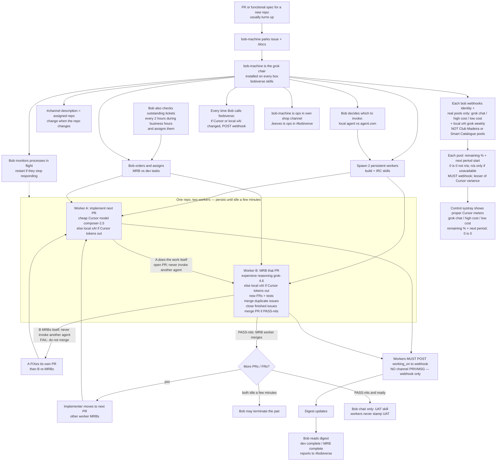

# Feature request: bob-{machine} two persistent workers per repo

**Parked:** 2026-09-22 by flamingo-24108 from Simon Query.  
**Repo:** SimonBarnett/agentic_build (extends current fleet; do not break v1 job loop).

## Proposed flow (Simon check this logic)

## Ask (LOCKED)

Change how Bob works:

1. **`bob-{machine}` is the grok agent** on that box.
2. He is **installed on all machines** and is given the skills to **join the bobiverse**.
3. Input is either a **feature request** or a **functional spec for a new repo**.
4. Bob **starts 2 workers** to handle the project (one repo) he is assigned.
5. Those agents **persist** until Bob no longer needs them.
6. Workers are **spawned by Bob** with **build + IRC** skills. They do **dev or MRB**.
7. **No self-review:** if one worker implemented a PR, the **other** must MRB; the implementer **moves to the next PR**.
8. Bob **does not terminate** workers until they have been **idle a few minutes**.
9. Workers **MUST** POST their current **working-on description to the webhook**.
10. That update **must appear on the digest** so we can see what everyone is working on.
11. **Bob refers to the digest** (MRB complete / dev complete / similar states) **to report to the bobiverse**.
12. The **repo name** a `#channel` is working on **is the channel description**. **Change it when the repo changes.**
13. **Bob** (chair only) **uses the new UAT skill** (`bob-design-uat` / design-uat) **to approve UAT**. Workers do not stamp UAT.
14. **Workers do their own work.** They **do not invoke another agent** (no nested Start-BobBuild / handoff spawn). The pair *is* the two workers.
15. **Bob monitors** worker processes **during flight** and **restarts** them if they stop responding.
16. **Bob orders and assigns** MRB vs dev tasks (chair assigns the role; worker executes it).
17. FRs **usually turn up**. Bob is also responsible for **checking outstanding tickets** and **assigning** them — **every 2 hours during business hours**.
18. **Same fuel as before:** build/dev is a **cheap Cursor model** (`composer-2.5`). **MRB is more expensive** (`grok-4.6`) because that is where we want **reasoning** to add new FRs and tests.
19. **MRB also:** merge **duplicate issues**, **close** issues that are done/superseded, and **merge PRs if PASS-nits**.
20. **Each bob** sends a **webhook to identify itself** and **how much local grok is left** on its account.
21. **Each bob** also reports the **Cursor values it sees for the whole account**. **Take the lesser of any variance.**
23. Usage pools are the **real Cursor/xAI meters**, not seat nicknames. There is **no Club Madeira pool** and **no Smart Catalogue pool** (those are xAI seat labels in `bob-seats.json`). Report:
    - **grok chat** (Sand)
    - **high cost models**
    - **low cost models** (cursor-models fuel)
    - **local xAI / Grok Build weekly** (per box seat)
    For each: **percent remaining** and **when the next period starts**. **0 shows 0, not n/a.** **n/a only when that pool is not available.** Every pool **MUST** be posted on the webhook.
24. **Workers use Cursor** unless **out of tokens**, then **their local xAI accounts**.
25. **Bob decides which to invoke:** `agent` (local) or `agent.com` (cloud).
26. **Every time Bob calls `!bobiverse`**, he **POSTs the webhook if anything changed** on **Cursor or local xAI** (change-only).
27. **`bob-{machine}` is ops in their own shop channel.** **Jeeves is ops in `#bobiverse`.**
28. **Update the control systray** to the **proper Cursor metrics** (grok chat / high cost / low cost — remaining % + next period; 0 is 0). Not seat-nickname pools.
22. **Workers do not send to the channel.** They **report only through the webhook**.

## Gap vs current tree (`be8cb6f`)

| Today | Required |
|-------|----------|
| `Start-BobBuild` / `Start-BobBuildLoop` / `Start-BobMrbHandoff` enqueue one-shot cursor/grok jobs; Watch-BobJobs pulls the queue | `bob-{machine}` (grok) owns a repo and keeps **two** live workers |
| Workers are `w-<short>-<pid>` shop-only, or ephemeral cursor-agent PIDs | Persist until Bob idles them out |
| MRB is a **new** job (`-Kind mrb`), never the implementer | Same pair: implementer vs MRB seat; implementer proceeds to next PR |
| `post_working_on` exists on talk seats (`#102` / agentic_irc) | **Workers** must POST; digest must show it |
| Talk seats + Watch recycle `bob-*` | `bob-{machine}` stays the grok chair on every box with bobiverse skills |

Do not break: hostile MRB (not own PR), no UAT stamp by workers, no `!bobiverse` from builders, no Other Models.

## MUST NOT

- Implementer reviews or merges their own PR (except PASS-nits MRB worker merge, existing rule).
- Stamp ready for human UAT (Bob chair only).
- Commit secrets / `password=` / API key assignments.
- Second-open a duplicate FR if this issue is the home.

## UNKNOWN

| ID | Item |
|----|------|
| U1 | Exact idle timeout (Simon: "a few minutes") — default **5 min** unless he sets it. |
| U2 | Whether the two workers are grok.exe, cursor-agent, or mixed (dev Composer / MRB Cursor Grok as today). |
| U3 | How this replaces vs wraps `Start-BobBuildLoop` on the same SHA. |
| U4 | New-repo path vs existing `bob-spec-intake` create-repo. |
| U5 | Business-hours window (tz + start/end). Cadence LOCKED: every 2 hours. |

## Acceptance

| ID | Check |
|----|--------|
| A1 | Skill/docs: `bob-{machine}` = grok chair; two workers per assigned repo. |
| A2 | Spawn path: Bob starts workers with build + IRC skills; they JOIN shop (and fleet policy). |
| A3 | Persist until Bob stops them after idle timeout (U1). |
| A4 | Implementer cannot MRB that PR; the other worker MRBs; implementer takes next PR. |
| A5 | Worker `working_on` POSTs to webhook; digest shows the description. |
| A6 | Bob reads digest states (dev complete / MRB complete / …) and reports them on #bobiverse. |
| A7 | Shop/channel **description** = current repo name; update when the assigned repo changes. |
| A8 | Bob chair approves UAT via the new UAT skill; workers never stamp UAT. |
| A9 | Workers implement/MRB/FIX themselves; they do not invoke another agent. |
| A10 | Bob monitors in-flight processes and restarts if deaf. |
| A11 | Bob assigns MRB vs dev; workers do not self-dispatch the other role. |
| A12 | Bob checks outstanding tickets every 2 hours during business hours and assigns them (FRs also arrive). |
| A13 | Dev = cheap Cursor model; MRB = expensive reasoning model (new FRs + tests). |
| A14 | MRB merges duplicate issues, closes finished/superseded issues, merges PASS-nits PRs. |
| A15 | Each bob webhooks identity + local grok remaining. |
| A16 | Each bob reports account-wide Cursor values; fleet uses the lesser if they differ. |
| A17 | Workers do not PRIVMSG shop/fleet channels; status is webhook-only. |
| A18 | Webhook usage = real pools (grok chat / high / low / local grok weekly). No Madeira/Catalogue pool names. |
| A19 | Each pool: remaining % + next period start; 0 is 0; n/a only if unavailable; MUST report. |
| A20 | Workers use Cursor until tokens are out, then local xAI. |
| A21 | Bob chooses local `agent` vs `agent.com` for each invoke. |
| A22 | On each Bob `!bobiverse`, webhook if Cursor or local xAI usage changed. |
| A23 | `bob-{machine}` is ops on `#{machine}`; Jeeves is ops on `#bobiverse`. |
| A24 | Control systray paints proper Cursor meters (not Madeira/Catalogue pool names). |
| A25 | BT0/docs validator or pack test covers A1–A24 enough to MRB. |
